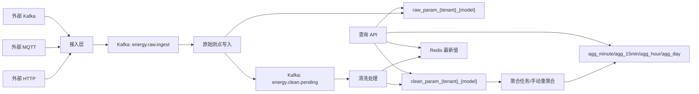

# Energy Data Access

面向工业能源场景的开源数采接入、清洗与聚合服务，适用于电表、水表、气表、热表等表计数据接入。项目重点解决多租户、多设备、多模型的统一协议接入、原始测点保存、常见异常清洗、分粒度聚合和查询服务。

当前版本更偏向“可运行的工程骨架 + 典型链路实现”，适合二次开发、方案验证和中小规模试点环境。

## 交流学习

欢迎关注工业数采、能源管理、碳管理、微网等方向的开发者、架构师、业务专家一起交流学习。这里既有技术大牛，也有业务专家，适合讨论工程实现、行业场景、产品设计和落地经验。

扫码添加微信，备注 `energy-data-access` 或 `工业数采`。


## 主要能力

- 统一协议接入：支持外部 HTTP、外部 MQTT、外部 Kafka 三种入口。
- 内部统一 Kafka Topic：接入层统一转发到内部 raw topic，按消息 key 保持同设备顺序。
- 原始测点落库：解码后的测点明细按租户和模型自动建表保存，不对重复上送做去重。
- 数据清洗：支持格式异常、量程异常、突增突降、累计倒退、表计回卷、重复有效值标记。
- 公式转换：清洗配置支持简单四则运算公式，例如 `x * 1000`、`x / 1000`。
- 清洗配置管理：提供清洗规则保存、查询、禁用、手动刷新接口。
- 实时最新值：清洗成功后写入 Redis，查询时优先 Redis，未命中降级查询清洗表。
- 数据聚合：支持分钟、15 分钟、小时、天聚合，小时和天从下级聚合逐级计算。
- 手动重聚合：支持人工指定租户、模型、设备、测点和时间范围重算。
- 多存储适配：原始测点存储支持 ClickHouse 和 TDengine 配置切换，当前清洗与聚合实现优先面向 ClickHouse。

## 技术栈

- Java 8
- Spring Boot 2.2.2
- Spring Kafka
- Eclipse Paho MQTT Client
- ClickHouse JDBC
- TDengine JDBC Driver
- Redis
- Maven
- Docker Compose

## 架构流程



## 快速开始

### 1. 环境要求

- JDK 8
- Maven 3.6+
- Docker 与 Docker Compose
- curl

### 2. 启动依赖

项目提供了开发用 Docker Compose，包含 MQTT、Kafka、ClickHouse、Redis。

```bash
cd energy-data-access
docker compose -f deploy/docker-compose.dev.yml up -d
```

国内网络环境下，Compose 文件默认使用 `docker.1ms.run` 镜像前缀。如果你的环境可以直接访问 Docker Hub，也可以把镜像改回官方镜像。

### 3. 编译运行

```bash
mvn test
mvn -DskipTests package
java -jar target/energy-data-access-0.1.0-SNAPSHOT.jar
```

服务默认端口：`8088`

健康检查：

```bash
curl http://127.0.0.1:8088/actuator/health
```

### 4. 开启 MQTT 接入

默认配置中 MQTT 接入关闭。可以参考 `deploy/application-mqtt-test.yml` 启动：

```bash
java -jar target/energy-data-access-0.1.0-SNAPSHOT.jar \
  --spring.config.additional-location=deploy/application-mqtt-test.yml
```

发布一条测试数据：

```bash
docker exec energy-data-access-mqtt mosquitto_pub \
  -h 127.0.0.1 -p 1883 \
  -t v2/tenant_demo/electric_meter/device_001/telemetry \
  -m '{"protocolVersion":"v2","tenantMark":"tenant_demo","modelMark":"electric_meter","deviceMark":"device_001","messageId":"msg-001","timestamp":"2026-05-23T08:00:00Z","data":{"kwh_total":123.45,"voltage":220.1}}'
```

### 5. HTTP 接入示例

```bash
curl -X POST http://127.0.0.1:8088/ingest/v2/tenant_demo/electric_meter/device_001/telemetry \
  -H 'Content-Type: application/json' \
  -d '{"messageId":"msg-002","timestamp":"2026-05-23T08:01:00Z","data":{"kwh_total":124.20,"voltage":219.8}}'
```

## 常用接口

### 清洗配置

保存或修改清洗配置：

```bash
curl -X POST http://127.0.0.1:8088/config/clean-point/save \
  -H 'Content-Type: application/json' \
  -d '{"tenantMark":"tenant_demo","modelMark":"electric_meter","paramMark":"kwh_total","transformFormula":"x","cumulative":true,"rolloverEnabled":true,"rolloverMaxValue":"999999","rolloverMinPreviousValue":"990000","rolloverMaxCurrentValue":"1000","enabled":true}'
```

查询清洗配置：

```bash
curl -X POST http://127.0.0.1:8088/config/clean-point/list \
  -H 'Content-Type: application/json' \
  -d '{"tenantMark":"tenant_demo","modelMark":"electric_meter"}'
```

### 查询原始测点

```bash
curl -X POST http://127.0.0.1:8088/query/raw/points \
  -H 'Content-Type: application/json' \
  -d '{"tenantMark":"tenant_demo","modelMark":"electric_meter","deviceMarks":["device_001"],"pageNo":1,"pageSize":20}'
```

### 查询清洗明细

```bash
curl -X POST http://127.0.0.1:8088/query/clean/points \
  -H 'Content-Type: application/json' \
  -d '{"tenantMark":"tenant_demo","modelMark":"electric_meter","deviceMarks":["device_001"],"effectiveOnly":true,"pageNo":1,"pageSize":20}'
```

### 查询实时最新值

```bash
curl -X POST http://127.0.0.1:8088/query/clean/latest \
  -H 'Content-Type: application/json' \
  -d '{"tenantMark":"tenant_demo","modelMark":"electric_meter","deviceMarks":["device_001"],"paramMarks":["kwh_total","voltage"]}'
```

### 手动重聚合

```bash
curl -X POST http://127.0.0.1:8088/aggregate/recompute \
  -H 'Content-Type: application/json' \
  -d '{"tenantMark":"tenant_demo","modelMark":"electric_meter","deviceMarks":["device_001"],"paramMarks":["kwh_total"],"startTime":"2026-05-23T08:00:00Z","endTime":"2026-05-23T09:00:00Z","reason":"manual-check"}'
```

### 查询聚合数据

```bash
curl -X POST http://127.0.0.1:8088/query/aggregate/points \
  -H 'Content-Type: application/json' \
  -d '{"tenantMark":"tenant_demo","modelMarks":["electric_meter"],"granularity":"15min","deviceMarks":["device_001"],"paramMarks":["kwh_total"],"startTime":"2026-05-23T08:00:00Z","endTime":"2026-05-23T10:00:00Z","pageNo":1,"pageSize":50}'
```

## 测试脚本

```bash
# HTTP 可靠性测试：重复上送也完整保存
BASE_URL=http://127.0.0.1:8088 REPEAT=3 scripts/http_reliability_check.sh

# HTTP 性能基线测试
BASE_URL=http://127.0.0.1:8088 TOTAL=10000 CONCURRENCY=50 scripts/http_performance_check.sh

# MQTT 多租户持续上送
MQTT_HOST=127.0.0.1 MQTT_PORT=1884 scripts/mqtt_sustained_load.sh
```

更多测试说明见：[docs/testing.md](docs/testing.md)。

## 文档

- [技术方案说明](docs/technical-solution.md)
- [数据接入、清洗、聚合详细设计](docs/data-ingestion-and-cleaning-design.md)
- [测试说明](docs/testing.md)
- [开源说明](docs/open-source-guide.md)

## 当前限制

- 暂不支持 Modbus 直连采集，当前定位为平台侧数据接入服务。
- 清洗和聚合表当前主要按 ClickHouse 实现，TDengine 适配重点在原始测点写入层。
- 聚合多模型查询的分页为第一版实现，按模型表查询后合并；大范围多模型查询建议后续升级为游标分页或全局排序分页。
- 没有内置认证鉴权，生产环境应放在网关或内网可信网络后，并补充租户级鉴权。

## 开源协议

本项目使用 MIT License，详见 [LICENSE](LICENSE)。
