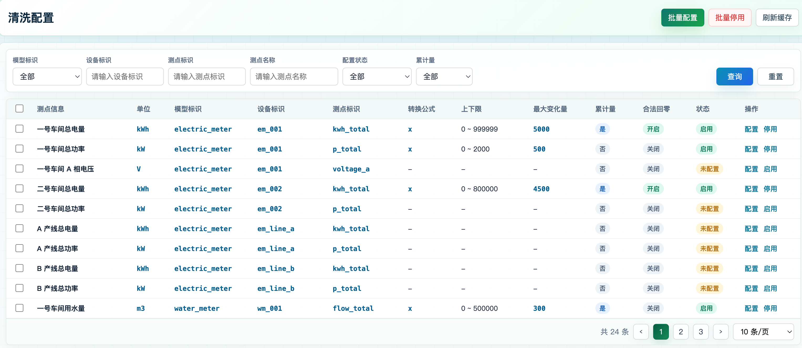
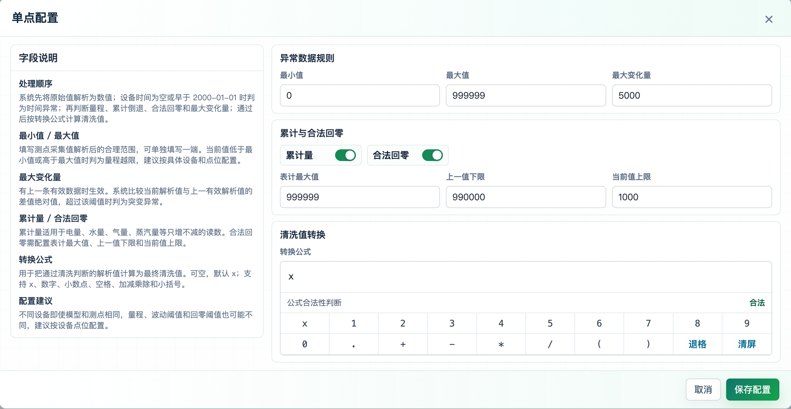
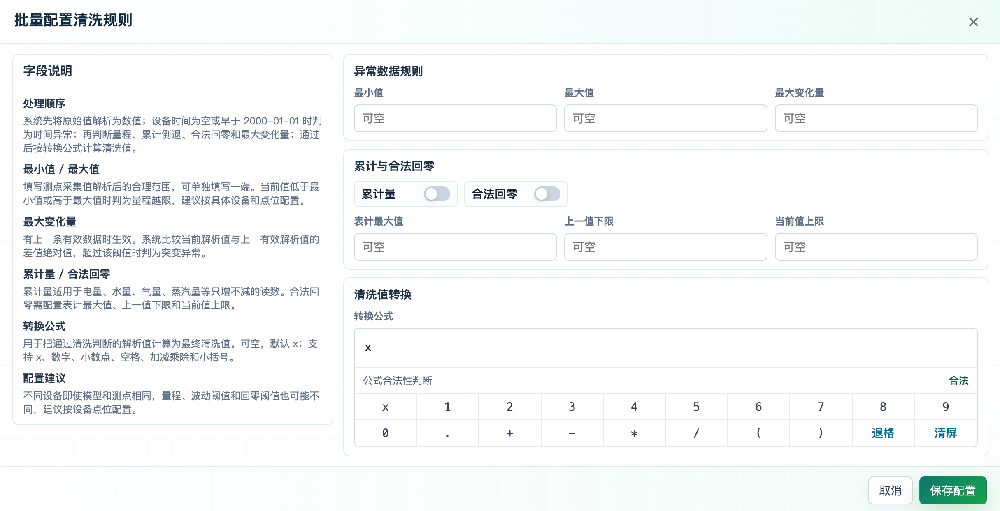
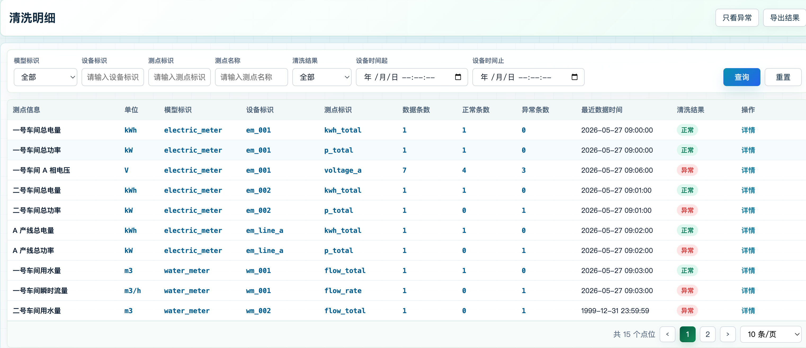
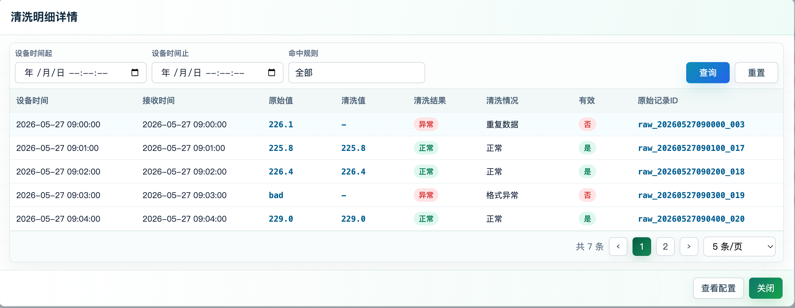

# 数据清洗产品需求文档

> 文档编码：EAP-DA-CLEANING-PRD  
> 文档状态：评审稿  
> 更新时间：2026-05-28  
> 适用范围：数据清洗前端配置应用、配置粒度改造与清洗明细页面  
> 已有能力：清洗执行、清洗记录表创建、清洗记录写入和清洗明细基础查询由 `energy-data-access` 服务满足，本文不重复定义  
> 文件编码：UTF-8

## 1. 背景

能源数据平台通过 `energy-data-access` 接收设备上送的原始测点数据。原始数据可能存在格式异常、设备时间异常、重复数据、越限、突变、累计量倒退、合法回零、公式转换失败等情况。为了保证后续实时值、聚合、报表和告警使用的数据可追溯、可解释，需要建设面向租户的“数据清洗”能力。

当前清洗执行、清洗记录落库和清洗明细基础查询由 `energy-data-access` 服务满足。本 PRD 聚焦清洗配置页面、清洗明细页面、配置按设备粒度补齐、页面交互、接口补充和验收标准。

## 2. 目标

1. 租户管理员可在页面中查看当前租户下所有测点的清洗配置状态。
2. 租户管理员可对单个或多个测点配置清洗规则。
3. 清洗规则按设备粒度生效。同一模型和同一测点标识在不同设备上的量程、突变阈值、累计回零阈值可以不同。
4. 清洗配置字段口径必须贴合 `energy-data-access` 当前服务能力，避免页面字段和后端行为不一致。
5. 租户管理员可按时间范围查看每个测点在该时间段内的清洗概况，并进入详情查看该点位的明细数据。
6. 清洗明细查询需要限制时间范围，并避免一次性查询过多点位明细导致接口耗时过长。
7. 页面查询和详情展示需要承接 `energy-data-access` 已有清洗记录追溯能力。

## 3. 非目标

1. 不在本阶段建设复杂公式函数库，只支持 `x`、数字、小数点、空格、加减乘除和小括号。
2. 不在配置页面提供统计分析看板、异常趋势图、占比图等统计型功能。
3. 不在清洗配置弹窗中维护租户、模型、设备、测点基础信息，只维护清洗规则字段。
4. 不在清洗明细列表中全量展示每个点位的所有明细记录，列表只展示点位级概况。
5. 不在本阶段支持跨租户配置、跨租户查询。

## 4. 用户角色

| 角色 | 权限范围 | 主要诉求 |
| --- | --- | --- |
| 租户超管 | 当前租户全部测点 | 配置清洗规则、停用配置、查看异常明细 |
| 能源主管 | 当前租户全部测点 | 查看清洗结果，定位异常点位 |
| 运维人员 | 当前租户全部设备和测点 | 根据设备现场量程、回零规则维护配置 |
| 平台管理员 | 平台运维 | 查看租户问题、辅助排查链路，不直接替租户配置业务规则 |

本阶段只按租户隔离数据，不做角色级设备和测点范围过滤。

## 5. 菜单与页面

顶部模块：`数据清洗`

左侧菜单：

1. `清洗配置`
2. `清洗明细`

旧菜单 `清洗规则`、`异常数据` 不再作为本模块入口展示。

## 6. 清洗配置页面

### 6.1 页面目标

分页展示当前租户下所有测点，用户通过筛选或复选框选择测点后，下发清洗规则配置。

严格以我提供的原型作为页面级验收规格实现


### 6.2 列表筛选条件

| 字段 | 控件 | 说明 |
| --- | --- | --- |
| 模型标识 | 下拉框 | 支持全部和单模型筛选 |
| 设备标识 | 输入框 | 模糊查询 |
| 测点标识 | 输入框 | 模糊查询 |
| 测点名称 | 输入框 | 模糊查询 |
| 配置状态 | 下拉框 | 全部、已启用、已停用、未配置 |
| 累计量 | 下拉框 | 全部、是、否 |

筛选条件需要单行紧凑展示。下拉内容必须在控件下方展开，不得遮挡当前控件。

### 6.3 列表字段

| 列名 | 说明 |
| --- | --- |
| 复选框 | 用于选择批量配置或批量停用的测点 |
| 测点信息 | 测点名称 |
| 单位 | 测点单位，单独成列 |
| 模型标识 | `modelMark` |
| 设备标识 | `deviceMark` |
| 测点标识 | `paramMark` |
| 转换公式 | 当前配置的 `transformFormula`，未配置显示 `-` |
| 上下限 | `minValue ~ maxValue`，未配置显示 `-` |
| 最大变化量 | `maxDelta` |
| 累计量 | 是、否 |
| 合法回零 | 开启、关闭 |
| 状态 | 启用、停用、未配置 |
| 操作 | 配置、启用、停用 |

列表宽度要自适应，可手动调节宽度

### 6.4 顶部操作

| 操作 | 规则 |
| --- | --- |
| 批量配置 | 必须先勾选至少一个测点；未勾选时不打开弹窗，提示“请先勾选要配置的测点” |
| 批量停用 | 必须先勾选至少一个测点；对选中测点写入停用配置 |
| 刷新缓存 | 调用后端配置 reload 能力，立即刷新应用内存配置 |

### 6.5 行操作

| 操作 | 规则 |
| --- | --- |
| 配置 | 打开单点配置弹窗，带入该测点已有配置或默认配置 |
| 启用 | 对未配置或停用配置写入启用状态 |
| 停用 | 对已启用配置写入停用状态 |

### 6.6 分页

分页控件样式：

```text
共 30 条  <  1  2  3  >  10 条/页
```

默认每页 10 条，支持 10、20、50 条/页。 页面数据未铺满高度时，始终保持分页控件在底部

## 7. 清洗配置弹窗
单点清洗配置,严格以我提供的原型作为页面级验收规格实现



批量清洗配置,严格以我提供的原型作为页面级验收规格实现



### 7.1 弹窗类型

| 类型 | 触发方式 | 标题 |
| --- | --- | --- |
| 单点配置 | 行操作“配置” | 单点配置 |
| 批量配置 | 顶部“批量配置” | 批量配置清洗规则 |

批量配置时，同一套配置字段写入所有已选测点。弹窗中不展示租户、模型、设备、测点字段。

### 7.2 字段说明区

弹窗左侧展示字段说明，右侧仅保留控件和字段名。控件标签不同时展示英文名。

字段说明必须包含：

1. 处理顺序
2. 最小值 / 最大值
3. 最大变化量
4. 累计量
5. 合法回零
6. 转换公式
7. 配置建议

### 7.3 规则字段

| 字段 | 类型 | 必填 | 默认值 | 说明 |
| --- | --- | --- | --- | --- |
| 最小值 | 数字字符串 | 否 | 空 | 解析值低于该值时判为量程越限 |
| 最大值 | 数字字符串 | 否 | 空 | 解析值高于该值时判为量程越限 |
| 最大变化量 | 数字字符串 | 否 | 空 | 与上一条有效判断值的差值绝对值超过该值时判为突变异常 |
| 累计量 | 开关 | 否 | 关闭 | 适用于电量、水量、气量、蒸汽量等只增不减读数 |
| 合法回零 | 开关 | 否 | 关闭 | 累计量出现低值回零时的合法性判断 |
| 表计最大值 | 数字字符串 | 合法回零开启时必填 | 空 | 表计上限，用于后续累计增量计算 |
| 上一值下限 | 数字字符串 | 合法回零开启时必填 | 空 | 上一有效判断值达到该值后，才允许回零 |
| 当前值上限 | 数字字符串 | 合法回零开启时必填 | 空 | 当前解析值低于或等于该值时，才允许回零 |
| 转换公式 | 公式组件 | 否 | `x` | 通过异常规则后的解析值转换为最终清洗值 |

### 7.4 公式组件

公式配置使用强约束组件，不提供自由文本输入。

支持输入：

1. 变量：`x`
2. 数字：`0-9`
3. 小数点：`.`
4. 运算符：`+`、`-`、`*`、`/`
5. 小括号：`(`、`)`
6. 空格

公式需要满足四则运算语法。示例：

```text
x
x / 1000
(x - 4) * 25
```

不支持：

1. `Max`、`Min`、`Avg`、`Inc`
2. 百分号
3. 逗号
4. 指数、幂运算
5. 任意函数调用

### 7.5 弹窗布局

1. 弹窗内容在常规 1366x768 视口下不应出现内部滚动。
2. 开关控件尺寸需与表单高度协调，不能过大。

### 7.6 输入校验

1. 输入框要有数据类型校验，只能输入有效数字。

## 8. 清洗执行口径

清洗执行、质量码判定、重复判定、清洗记录写入和最新值发布由 `energy-data-access` 服务满足，本文不再重复描述服务内部实现。

前端页面只需要按服务返回结果展示：

1. 清洗结果：正常、异常。
2. 清洗情况：展示服务返回的清洗情况或质量码含义。
3. 配置字段：按本 PRD 的配置弹窗字段进行展示和保存。

## 9. 清洗明细页面

### 9.1 页面目标

按点位聚合展示查询时间范围内的清洗概况。每个点位只展示一行，不在列表中展示所有明细记录。

严格以我提供的原型作为页面级验收规格实现


### 9.2 筛选条件

| 字段 | 控件 | 说明 |
| --- | --- | --- |
| 模型标识 | 下拉框 | 支持全部和单模型 |
| 设备标识 | 输入框 | 模糊查询 |
| 测点标识 | 输入框 | 模糊查询 |
| 测点名称 | 输入框 | 模糊查询 |
| 清洗结果 | 下拉框 | 全部、正常、异常 |
| 设备时间起 | 时间控件 | `datetime-local` |
| 设备时间止 | 时间控件 | `datetime-local` |

时间范围最大 7 天。结束时间不能早于开始时间。筛选条件需要单行紧凑展示。下拉内容必须在控件下方展开，不得遮挡当前控件。

### 9.3 列表字段

| 列名 | 说明 |
| --- | --- |
| 测点信息 | 测点名称 |
| 单位 | 测点单位 |
| 模型标识 | `modelMark` |
| 设备标识 | `deviceMark` |
| 测点标识 | `paramMark` |
| 数据条数 | 时间范围内清洗记录总数 |
| 正常条数 | `effective=true` 且非异常结果数 |
| 异常条数 | `effective=false` 或异常质量码数量 |
| 最近数据时间 | 时间范围内最新设备时间 |
| 清洗结果 | 正常、异常。存在异常条数时为异常 |
| 操作 | 详情 |

表格字段宽度要自适应，并且可以手动调节宽度

### 9.4 顶部操作

| 操作 | 说明 |
| --- | --- |
| 只看异常 / 查看全部 | 切换是否仅展示存在异常的点位 |
| 导出结果 | 创建异步导出任务，导出当前筛选条件下的点位清洗概况 |

导出数据范围：有勾选记录时导出勾选记录，无勾选记录时根据筛选条件导出。不建设导出记录页面。

### 9.5 分页

分页控件样式：

```text
共 30 条  <  1  2  3  >  10 条/页
```

默认每页 10 条，支持 10、20、50 条/页。 页面数据未铺满高度时，始终保持分页控件在底部

### 9.6 详情弹窗

详情弹窗用于查看单个点位在指定时间范围内的所有清洗记录。

严格以我提供的原型作为页面级验收规格实现


弹窗筛选：

| 字段 | 控件 | 说明 |
| --- | --- | --- |
| 设备时间起 | 时间控件 | 可二次调整 |
| 设备时间止 | 时间控件 | 可二次调整 |
| 命中规则 | 多选 | 正常、格式异常、时间异常、重复数据、量程越限、突变异常、累计倒退、公式异常、合法回零 |

下拉内容必须在控件下方展开，不得遮挡当前控件。

#### 9.6.1  弹窗表格：

| 列名 | 说明 |
| --- | --- |
| 设备时间 | 原始数据设备时间 |
| 接收时间 | 平台接收时间 |
| 原始值 | `rawValue` |
| 清洗值 | `cleanValue` |
| 清洗结果 | 正常、异常 |
| 清洗情况 | 具体质量码含义 |
| 有效 | 是、否 |
| 原始记录ID | `rawId` |

表格字段宽度要自适应，并且可以手动调节宽度


#### 9.6.2 分页控件样式：

```text
共 30 条  <  1  2  3  >  10 条/页
```

默认每页 10 条，支持 10、20、50 条/页。 页面数据未铺满高度时，始终保持分页控件在底部

## 10. 接口需求

### 10.1 清洗配置接口

当前后端已有接口：

| 接口 | 方法 | 说明 |
| --- | --- | --- |
| `/config/clean-point/list` | POST | 查询清洗配置 |
| `/config/clean-point/save` | POST | 新增或修改清洗配置 |
| `/config/clean-point/disable` | POST | 禁用清洗配置 |
| `/config/clean-point/reload` | POST | 手动刷新配置缓存 |

目标请求字段：

| 字段 | 必填 | 说明 |
| --- | --- | --- |
| tenantMark | 是 | 租户标识 |
| modelMark | 是 | 模型标识 |
| deviceMark | 是 | 设备标识 |
| paramMark | 是 | 测点标识 |
| transformFormula | 否 | 转换公式，默认 `x` |
| minValue | 否 | 最小值 |
| maxValue | 否 | 最大值 |
| maxDelta | 否 | 最大变化量 |
| cumulative | 否 | 是否累计量 |
| rolloverEnabled | 否 | 是否启用合法回零 |
| rolloverMaxValue | 否 | 表计最大值 |
| rolloverMinPreviousValue | 否 | 上一值下限 |
| rolloverMaxCurrentValue | 否 | 当前值上限 |
| enabled | 否 | 是否启用 |

当前实现差距：

1. `CleanPointConfigSaveRequest` 和 `CleanPointConfigQueryRequest` 当前缺少 `deviceMark`。
2. `point_clean_config` 当前 `ORDER BY (tenant_mark, model_mark, param_mark)`，不能区分同模型同测点不同设备。
3. `CleanPointConfigProvider#getConfig` 当前按 `tenantMark + modelMark + paramMark` 获取配置。

为满足本 PRD，后端需要将配置粒度升级为：

```text
tenantMark + modelMark + deviceMark + paramMark
```

### 10.2 测点配置列表接口

页面需要分页展示当前租户下所有测点，并合并清洗配置状态。

推荐新增后端聚合接口：

```text
POST /config/clean-point/page
```

接口职责：

1. 根据租户查询基础服务中的测点主数据。
2. 按 `tenantMark + modelMark + deviceMark + paramMark` 合并清洗配置。
3. 支持模型、设备、测点、名称、配置状态、累计量筛选。
4. 服务端分页返回。

如短期不新增该接口，前端需要分别调用基础服务测点接口和 `/config/clean-point/list`，在前端合并；但当测点数量较大时不建议长期采用。

### 10.3 清洗明细概况数据获取

本阶段不新增清洗明细概况接口。清洗明细概况由前端聚合生成。

数据获取流程：

1. 前端按筛选条件调用基础服务测点接口，获取当前租户下的测点列表。
2. 前端将当前页或用户选中的测点下发到 `energy-data-access` 清洗明细查询接口。
3. `energy-data-access` 返回这些测点在指定时间范围内的清洗明细。
4. 前端按 `modelMark + deviceMark + paramMark` 聚合数据条数、正常条数、异常条数和最近数据时间。
5. 清洗结果按聚合后的异常条数判断：异常条数大于 0 时为异常，否则为正常。

约束：

1. 时间范围最大 7 天。
2. 单次下发测点数不超过当前分页大小，默认 10，最大 50。
3. 用户勾选测点后，只查询勾选测点；未勾选时，只查询当前页测点。
4. 不一次性查询当前租户下全部测点的清洗明细。

### 10.4 清洗明细记录接口

`energy-data-access` 服务已满足清洗明细基础查询：

```text
POST /query/clean/points
```

前端清洗明细概况和详情弹窗均使用该能力。概况查询可按当前页或已勾选测点批量下发；详情弹窗限定单个点位查询。页面侧约束：

1. 详情查询应限定单个点位。
2. 时间范围最大 7 天。
3. 结果按设备时间升序或降序需要前后端统一，默认建议按设备时间升序。

## 11. 数据模型

### 11.0 数据表清单

| 表 | 类型 | 说明 |
| --- | --- | --- |
| `point_clean_config` | 目标改造表 | 清洗规则配置表，本次需要补齐设备粒度，唯一配置口径为 `tenant_mark + model_mark + device_mark + param_mark` |
| `clean_param_{tenant}_{model}` | 已有能力 | `energy-data-access` 服务已满足清洗记录表创建、写入和查询，本次不新增、不改造该表 |

### 11.1 清洗配置表

目标改造表：`point_clean_config`

目标字段：

| 字段 | 类型 | 说明 |
| --- | --- | --- |
| tenant_mark | String | 租户标识 |
| model_mark | String | 模型标识 |
| device_mark | String | 设备标识 |
| param_mark | String | 测点标识 |
| transform_formula | String | 转换公式 |
| min_value | Nullable(String) | 最小值 |
| max_value | Nullable(String) | 最大值 |
| max_delta | Nullable(String) | 最大变化量 |
| is_cumulative | UInt8 | 是否累计量 |
| rollover_enabled | UInt8 | 是否启用合法回零 |
| rollover_max_value | Nullable(String) | 表计最大值 |
| rollover_min_previous_value | Nullable(String) | 上一值下限 |
| rollover_max_current_value | Nullable(String) | 当前值上限 |
| enabled | UInt8 | 是否启用 |
| version | UInt64 | 配置版本 |
| updated_time | DateTime | 更新时间 |

目标排序键：

```text
ORDER BY (tenant_mark, model_mark, device_mark, param_mark)
```

### 11.2 清洗记录表（已有能力）

清洗记录表由 `energy-data-access` 服务满足，本 PRD 不新增、不改造该表。

```text
clean_param_{tenant}_{model}
```

## 12. 校验规则

### 12.1 配置保存校验

1. `tenantMark`、`modelMark`、`deviceMark`、`paramMark` 必填。
2. 数值字段若填写，必须能转换为数字。
3. 转换公式必须符合公式组件允许的字符和四则运算语法。
4. 开启合法回零时，`rolloverMaxValue`、`rolloverMinPreviousValue`、`rolloverMaxCurrentValue` 必填。
5. 建议校验 `minValue <= maxValue`。当前代码未体现该校验，属于待补充项。
6. 建议校验 `maxDelta >= 0`。当前代码未体现该校验，属于待补充项。
7. 建议合法回零开启时必须同时开启累计量。当前代码允许单独开启合法回零，但只有累计量倒退场景会进入回零判断。

### 12.2 查询校验

1. 清洗明细列表和详情查询的时间范围不能超过 7 天。
2. 结束时间不能早于开始时间。
3. 清洗详情必须限定单个点位。
4. 分页大小需要设置上限，建议最大 100 条。

## 13. 权限

菜单权限：

| 权限 | 说明 |
| --- | --- |
| 数据清洗 | 顶部模块入口 |
| 清洗配置 | 查看清洗配置页面 |
| 清洗明细 | 查看清洗明细页面 |

按钮权限：

| 权限 | 说明 |
| --- | --- |
| 批量配置 | 允许批量保存清洗配置 |
| 配置规则 | 允许单点配置 |
| 启用停用配置 | 允许启用、停用配置 |
| 刷新缓存 | 允许手动刷新配置缓存 |
| 查看明细 | 允许打开清洗明细详情 |
| 导出结果 | 允许创建异步导出任务 |

## 14. 性能要求

1. 清洗配置列表需要服务端分页，避免一次性加载全部测点。
2. 清洗明细概况由前端聚合生成，前端只下发当前页或已勾选测点，不查询全量测点明细。
3. 清洗详情只查单个点位，必须分页。
4. 清洗详情时间范围默认不超过 7 天。
5. 清洗配置保存或禁用后，应立即 reload 当前应用内存配置。
6. 多实例部署时，每个实例需要独立刷新配置；如要求立即全实例生效，需要增加配置变更事件广播。

## 15. 异常提示

提示位置：页面上方居中。

提示类型：

| 类型 | 场景 |
| --- | --- |
| info | 保存成功、刷新成功、导出任务创建 |
| warn | 未选择测点、查询时间范围过大、时间范围不合法 |
| error | 保存失败、公式非法、数值字段非法、接口异常 |

## 16. 测试与验收

### 16.1 清洗配置验收

1. 进入 `数据清洗 / 清洗配置`，展示当前租户下测点列表。
2. 筛选条件能过滤列表，并保持单行紧凑展示。
3. 未勾选测点点击批量配置，不打开弹窗，并提示“请先勾选要配置的测点”。
4. 勾选多个测点点击批量配置，打开弹窗，保存后多个测点展示同一套配置。
5. 行操作“配置”打开单点配置弹窗。
6. 行操作“启用 / 停用”能更新状态。
7. 公式组件只能输入允许字符，非法公式不能保存。
8. 合法回零开启时缺少三个阈值不能保存。
9. 分页控件展示总数、页码、上一页、下一页、每页条数。

### 16.2 清洗明细验收

1. 进入 `数据清洗 / 清洗明细`，列表按点位展示概况，不展示每条明细。
2. 时间控件使用 `datetime-local`。
3. 查询时间超过 7 天时提示并阻止查询。
4. 概况由前端对当前页或已勾选测点的清洗明细聚合生成。
5. `只看异常` 能只展示存在异常的点位。
6. 导出结果创建异步导出任务，不跳转导出记录页面。
7. 点击详情进入单点详情弹窗。
8. 详情弹窗可二次调整时间范围。
9. 详情弹窗支持命中规则多选过滤，且不包含乱序数据。
10. 详情弹窗表格分页生效。
11. 详情弹窗不展示“清洗结论”“数据概况”等摘要块。

### 16.3 既有服务能力联调验收

1. 前端保存、停用、刷新缓存后，`energy-data-access` 服务按配置生效。
2. 清洗明细详情调用 `energy-data-access` 已有查询能力，数据能正常分页展示。
3. 前端不重新实现清洗规则判断，不在页面侧推导清洗结果。

## 17. 当前实现差距与待办

| 编号 | 差距 | 影响 | 建议 |
| --- | --- | --- | --- |
| G1 | 清洗配置后端当前缺少 `deviceMark` | 无法按设备配置不同上下限和回零阈值 | 配置表、DTO、Provider、Service、API 均增加 `deviceMark` |
| G2 | 清洗配置列表当前仅有配置 list，不包含所有测点分页 | 前端需要自行合并主数据和配置，数据量大时性能差 | 新增 `/config/clean-point/page` |
| G3 | 配置保存缺少 `min <= max`、`maxDelta >= 0` 等业务校验 | 可能保存无意义配置 | 后端补充校验，前端同步提示 |
| G4 | 多实例配置立即生效机制不明确 | reload 只影响当前实例 | 评估是否引入配置变更广播 |

## 18. 评审结论

1. 配置粒度确认升级为 `租户 + 模型 + 设备 + 测点`。
2. 清洗明细概况由前端聚合生成：前端先从基础服务获取测点，再将当前页或已选测点下发到 `energy-data-access` 清洗明细查询接口，最后在前端聚合概况。
3. 乱序数据不作为本阶段清洗规则。
4. 导出结果需要异步导出任务，不建设导出记录页面。
5. 不需要角色级数据权限过滤设备和测点范围。
