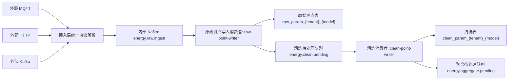

# 数据接入与数据清洗方案

本文档记录当前已确认并完成代码验证的数据接入阶段、数据清洗阶段方案。后续数据聚合、统计落库阶段应沿用本文档中的租户、模型分表规则和有效数据判定规则。

## 1. 总体链路



核心原则：

- 外部接入方式支持 MQTT、HTTP、Kafka，先不支持 Modbus。
- 外部三种接入方式统一使用同一种数据协议。
- 内部 Kafka 只承载解码后的统一协议消息，避免每种外部协议在内部重复适配。
- 原始存储保存的是解码后的测点明细，不是原始报文。
- 原始测点不去重。设备重复上送也完整保存，保证可追溯。
- 清洗队列只在原始测点落库成功后发送。清洗结果必须能回溯到原始测点。
- 原始、清洗、后续聚合表均按 `tenant_mark + model_mark` 分表。
- 存储引擎需要兼容 ClickHouse 和 TDengine，通过配置适配。

## 2. 数据接入阶段方案

### 2.1 接入方式

| 接入方式 | 说明 | 当前状态 |
| --- | --- | --- |
| 外部 MQTT | 客户侧或网关通过 MQTT topic 上报统一协议数据 | 已实现 |
| 外部 HTTP | 客户侧通过 HTTP API 上报统一协议数据 | 已实现 |
| 外部 Kafka | 客户侧 Kafka 消息转入内部统一 topic | 已实现 |

当前不支持 Modbus。后续如需支持 Modbus，建议作为边缘采集网关能力处理，网关仍转成统一协议后进入平台。

### 2.2 外部统一协议

外部消息应包含以下关键字段：

| 字段 | 作用 |
| --- | --- |
| `protocolVersion` | 协议版本。当前保留，用于未来协议兼容和灰度升级。 |
| `tenantMark` | 租户标识。用于分区 key、分表、权限隔离和数据归属。 |
| `modelMark` | 模型标识。用于按租户+模型分表，控制表规模。 |
| `deviceMark` | 设备标识。用于设备维度查询、重复判断、聚合分组。 |
| `messageId` | 上送消息标识。用于链路追踪、问题排查、测试验证。 |
| `timestamp` | 设备侧采集时间。用于生成 `normal_second`，也是清洗、聚合的时间基准。 |
| `data` | 测点集合。key 是 `paramMark`，value 是原始测点值。 |

示例：

```json
{
  "protocolVersion": "v2",
  "tenantMark": "tenant_1",
  "modelMark": "energy_meter_1",
  "deviceMark": "device_1",
  "messageId": "msg-001",
  "timestamp": "2026-05-22T04:00:00Z",
  "data": {
    "electric_total": 12345,
    "water_total": 100,
    "gas_total": 88
  }
}
```

### 2.3 内部 Kafka 设计

| Topic | 用途 |
| --- | --- |
| `energy.raw.ingest` | 接入层统一转发后的原始测点待落库消息。 |
| `energy.clean.pending` | 原始测点落库成功后发出的清洗待处理事件。 |
| `energy.aggregate.pending` | 清洗后有效数据发出的聚合待处理事件。 |
| `energy.external.ingest` | 外部 Kafka 接入的入口 topic。 |

Kafka key 采用：

```text
tenantMark|modelMark|deviceMark
```

作用：

- 同一租户、同一模型、同一设备的数据尽量进入同一 partition。
- 同一设备内的数据顺序更容易保持。
- 可以减少同设备累计表读数乱序导致的清洗误判。

当前采用统一内部 topic，不再按租户拆 topic。租户维度通过 key、消息字段和表名识别。

### 2.4 Consumer Group 设计

| Consumer Group | 消费 topic | 职责 |
| --- | --- | --- |
| `raw-point-writer` | `energy.raw.ingest` | 解码测点明细并写入原始测点表，成功后发送清洗事件。 |
| `clean-point-writer` | `energy.clean.pending` | 从原始测点表读取数据，执行清洗并写入清洗表，成功后发送聚合事件。 |
| `external-kafka-forwarder` | `energy.external.ingest` | 外部 Kafka 消息转发到内部统一 raw topic。 |

关于 Consumer Group：

- 一个 Consumer Group 表示一组共同处理同一个 topic 的消费者。
- 同一 group 内，一个 partition 同一时刻只会分配给一个消费者。
- 扩容消费者时，Kafka 会把 partition 在同一 group 内重新分配。
- 当前不是“每个租户一个 topic/consumer”，而是统一 topic + 消息 key + 数据字段区分租户。
- 大量租户、每个租户数据量不特别大的场景，更适合统一 topic，避免 topic 和 consumer 数量爆炸。

### 2.5 原始测点落库

原始测点表命名：

```text
raw_param_{tenant_mark}_{model_mark}
```

示例：

```text
raw_param_tenant_clean_energy_meter_clean
```

核心字段：

| 字段 | 作用 |
| --- | --- |
| `id` | 原始测点行唯一标识。用于清洗事件回查、清洗表关联、问题追溯。 |
| `message_id` | 上送消息标识。用于链路追踪和批次定位。 |
| `protocol_version` | 协议版本。保留用于协议兼容。 |
| `tenant_mark` | 租户标识。 |
| `model_mark` | 模型标识。 |
| `device_mark` | 设备标识。 |
| `param_mark` | 测点标识。 |
| `raw_value` | 解码后的原始测点值。 |
| `device_time` | 设备采集时间。 |
| `receive_time` | 平台接收时间。 |
| `normal_second` | 归一化秒级时间戳，供查询、清洗、聚合使用。 |
| `created_time` | 原始测点入库时间。 |

不落库字段：

- `batch_id`
- `action`
- `param_hash`
- `source_type`
- `source_topic`
- `remote_ip`
- `token_id`
- `access_key`

说明：

- 原始表不做重复过滤。重复上送就是业务事实，应完整保存。
- 当前先不存原始报文。未来如果需要存报文，建议在接入层收到数据时无差别旁路存储，不经过内部 Kafka 解码链路。

### 2.6 接入一致性策略

数据接入阶段的关键一致性规则：

1. 外部数据进入接入层。
2. 接入层统一协议解析并转发到内部 Kafka `energy.raw.ingest`。
3. `raw-point-writer` 消费内部 raw topic。
4. 原始测点写入 `raw_param_{tenant}_{model}`。
5. 只有原始测点落库成功，才发送 `CleaningEvent` 到 `energy.clean.pending`。
6. 如果原始测点未落库，不进入清洗，避免清洗结果无法追溯。

## 3. 数据清洗阶段方案

### 3.1 清洗目标

清洗阶段覆盖常见工业能耗表计 80% 场景：

- 非数字、空值、占位符等格式异常。
- 设备时间异常。
- 上下限量程异常。
- 短时间突变异常。
- 重复数据识别。
- 累计表倒退识别。
- 累计表合法回零识别。
- 简单公式转换。

### 3.2 清洗输入

清洗消费者不直接消费原始 payload，而是消费 `energy.clean.pending` 中的清洗事件。

清洗事件包含：

| 字段 | 作用 |
| --- | --- |
| `tableName` | 原始测点表名。 |
| `rawIds` | 本次需清洗的原始测点 id 列表。 |
| `tenantMark` | 租户标识。 |
| `modelMark` | 模型标识。 |
| `deviceMark` | 设备标识。 |
| `messageId` | 上送消息标识。 |

清洗消费者根据 `tableName + rawIds` 回查原始测点表，确保清洗结果能关联到原始数据。

### 3.3 清洗表设计

清洗表命名：

```text
clean_param_{tenant_mark}_{model_mark}
```

示例：

```text
clean_param_tenant_clean_energy_meter_clean
```

核心字段：

| 字段 | 作用 |
| --- | --- |
| `id` | 清洗记录唯一标识。 |
| `raw_id` | 关联原始测点 id。 |
| `message_id` | 上送消息标识。 |
| `protocol_version` | 协议版本。 |
| `tenant_mark` | 租户标识。 |
| `model_mark` | 模型标识。 |
| `device_mark` | 设备标识。 |
| `param_mark` | 测点标识。 |
| `raw_value` | 原始测点值。 |
| `clean_value` | 清洗/转换后的值。格式异常时允许为空。 |
| `device_time` | 设备采集时间。 |
| `receive_time` | 平台接收时间。 |
| `normal_second` | 秒级归一化时间。 |
| `quality_code` | 清洗质量码。 |
| `effective_flag` | 是否有效。只有 1 才进入聚合。 |
| `duplicate_of_id` | 如果是重复数据，指向原有效清洗记录 id。 |
| `clean_rule` | 命中的清洗规则，例如 `normal`、`range`、`delta`。 |
| `created_time` | 清洗记录创建时间。 |

清洗表保留全部记录，不只保留有效数据。这样异常、重复、无效数据都可审计和追溯。

### 3.4 清洗配置表

配置表：

```text
point_clean_config
```

当前使用 ClickHouse：

```text
ENGINE = ReplacingMergeTree(version)
ORDER BY (tenant_mark, model_mark, param_mark)
```

关键字段：

| 字段 | 作用 |
| --- | --- |
| `tenant_mark` | 租户标识。 |
| `model_mark` | 模型标识。 |
| `param_mark` | 测点标识。 |
| `transform_formula` | 转换公式，默认 `x`。 |
| `min_value` | 合理最小值，可空。 |
| `max_value` | 合理最大值，可空。 |
| `max_delta` | 与上一条有效值相比允许的最大变化量，可空。 |
| `is_cumulative` | 是否累计表计。 |
| `rollover_enabled` | 是否启用合法回零识别。 |
| `rollover_max_value` | 表计最大值。 |
| `rollover_min_previous_value` | 允许回零时，上一条有效值需要达到的最小值。 |
| `rollover_max_current_value` | 允许回零时，当前值需要小于等于的最大值。 |
| `enabled` | 是否启用。 |
| `version` | 配置版本。 |
| `updated_time` | 更新时间。 |

配置刷新：

- 配置数据存储在 DB。
- 应用启动时加载一次。
- 运行中每 4 分钟刷新一次。
- 第一版不引入 Redis，直接使用本地内存缓存。
- 多实例部署时，每个实例独立刷新配置。

### 3.5 公式转换

转换公式不参与异常数据清洗规则判断。处理顺序为：

1. 先将 `raw_value` 解析为数值 `parsed_value`。
2. `min_value`、`max_value`、`max_delta`、累计倒退、合法回零均基于 `parsed_value` 判断。
3. 上一条有效判断值从上一条有效记录的 `raw_value` 解析得到，不使用转换后的 `clean_value`。
4. 通过异常规则后，再执行 `transform_formula`，结果写入 `clean_value`。

当前公式能力保持克制，只支持：

- 变量：`x`
- 数字
- `+`
- `-`
- `*`
- `/`
- 小括号

示例：

```text
x
x / 1000
(x + 10) * 2
```

当前不开放复杂函数，避免配置人员不理解函数语义导致误配置。单位统一也不做独立模块，由人工通过公式配置完成。

### 3.6 清洗质量码

| quality_code | 含义 | effective_flag |
| --- | --- | --- |
| `0` | 正常数据 | 1 |
| `1` | 格式异常，例如非数字、空值、`--`、`nan` | 0 |
| `2` | 时间异常 | 0 |
| `3` | 公式异常 | 0 |
| `4` | 重复数据 | 0 |
| `6` | 超出上下限 | 0 |
| `7` | 突变异常 | 0 |
| `8` | 累计表倒退 | 0 |
| `10` | 合法回零 | 1 |

### 3.7 重复数据处理

重复判断条件：

```text
tenant_mark + device_mark + param_mark + normal_second + clean_value
```

处理方式：

- 第一条有效数据保留为 `quality_code=0`、`effective_flag=1`。
- 后续重复数据仍写入清洗表。
- 重复数据标记为 `quality_code=4`、`effective_flag=0`。
- 如果能找到原有效记录，则写入 `duplicate_of_id`。
- 重复数据不进入后续聚合。

注意：原始表不去重。重复识别只发生在清洗表，不影响原始数据完整性。

### 3.8 累计表倒退与合法回零

累计表计常见场景：

- 正常递增：有效。
- 当前值小于上一条有效值：默认视为累计倒退，无效。
- 达到表计量程后从 0 附近重新开始：视为合法回零，有效。

合法回零判断条件：

```text
is_cumulative = true
rollover_enabled = true
previous >= rollover_min_previous_value
current <= rollover_max_current_value
rollover_max_value is not null
```

处理方式：

- 合法回零标记为 `quality_code=10`、`effective_flag=1`、`clean_rule=rollover`。
- 非法倒退标记为 `quality_code=8`、`effective_flag=0`、`clean_rule=cumulative_rollback`。
- 合法回零应先于突变判断，避免回零被误判为突变。
- 后续聚合计算增量时，对合法回零使用。`rollover_max_value` 配置口径为解析值，聚合时需先按 `transform_formula` 转换为清洗值口径：

```text
(transform(rollover_max_value) - previous_value) + current_value
```

### 3.9 清洗输出

清洗成功后：

1. 所有清洗记录写入 `clean_param_{tenant}_{model}`。
2. 只有 `effective_flag=1` 的记录会发送到 `energy.aggregate.pending`。
3. 聚合事件包含：
   - `cleanTable`
   - `cleanId`
   - `messageId`
   - `tenantMark`
   - `modelMark`
   - `deviceMark`
   - `paramMark`
   - `normalSecond`

### 3.10 清洗一致性策略

清洗阶段的关键一致性规则：

1. 只处理已经成功落入原始表的测点。
2. 清洗结果写入清洗表。
3. 清洗表写入成功后，只有有效数据发送聚合事件。
4. 清洗失败或异常数据也应尽量落入清洗表，便于追溯。
5. 聚合阶段只认 `effective_flag=1` 的清洗数据。

## 4. 当前验证结果

本地验证：

```text
mvn test
Tests run: 19, Failures: 0, Errors: 0, Skipped: 0
```

开发联调环境示例：

```text
host: 127.0.0.1
app: UP
kafka: 127.0.0.1:9092
clickhouse: 127.0.0.1:8123
mqtt: 127.0.0.1:1884
```

最终 MQTT 异常场景：

```text
run_id = clean-anomaly-1779510163
```

验证结果：

| 指标 | 结果 |
| --- | --- |
| 原始测点行数 | 11 |
| 清洗表行数 | 11 |
| 有效清洗行数 | 6 |
| 聚合待处理事件数 | 6 |
| raw-point-writer lag | 0 |
| clean-point-writer lag | 0 |

质量码分布：

| quality_code | effective_flag | 行数 |
| --- | --- | --- |
| 0 | 1 | 5 |
| 1 | 0 | 1 |
| 4 | 0 | 1 |
| 6 | 0 | 1 |
| 7 | 0 | 1 |
| 8 | 0 | 1 |
| 10 | 1 | 1 |

场景明细：

| param_mark | raw_value | clean_value | quality_code | effective_flag | clean_rule |
| --- | --- | --- | --- | --- | --- |
| `normal_param` | `10` | `10` | 0 | 1 | `normal` |
| `normal_param` | `10` | `10` | 4 | 0 | `normal` |
| `format_param` | `not-a-number` | null | 1 | 0 | `parse` |
| `range_param` | `200` | `200` | 6 | 0 | `range` |
| `spike_param` | `10` | `10` | 0 | 1 | `normal` |
| `spike_param` | `1000` | `1000` | 7 | 0 | `delta` |
| `rollback_param` | `1000` | `1000` | 0 | 1 | `normal` |
| `rollback_param` | `10` | `10` | 8 | 0 | `cumulative_rollback` |
| `rollover_param` | `999980` | `999980` | 0 | 1 | `normal` |
| `rollover_param` | `25` | `25` | 10 | 1 | `rollover` |
| `formula_param` | `8000` | `8` | 0 | 1 | `normal` |

## 5. 已知注意事项

- ClickHouse HTTP 默认不支持一次提交多条 SQL，脚本中建表和插入需要分开提交。
- 测试环境如果 `energy.clean.pending` 留有大量历史 backlog，新清洗消费者第一次启动会先消费历史数据；测试当前场景时需要关注 consumer group offset。
- 当前清洗配置 4 分钟刷新一次；如果测试刚写入配置，可以重启应用或等待刷新。
- 当前重复判断依赖 `normal_second`，如果设备上送时间固定且重复运行同一设备测试，会被历史有效数据影响。测试脚本已默认按 `RUN_ID` 生成独立设备号。
- 当前清洗表使用 `MergeTree ORDER BY (device_mark, param_mark, normal_second)`。后续大规模查询可继续评估是否增加分区、投影或物化视图。

## 6. 数据聚合阶段方案

聚合阶段采用逐级聚合，链路如下：

```text
clean_param_{tenant}_{model}
  -> agg_minute_param_{tenant}_{model}
  -> agg_15min_param_{tenant}_{model}
  -> agg_hour_param_{tenant}_{model}
  -> agg_day_param_{tenant}_{model}
```

分表规则继续与原始、清洗保持一致：

```text
raw_param_{tenant}_{model}
clean_param_{tenant}_{model}
agg_minute_param_{tenant}_{model}
agg_15min_param_{tenant}_{model}
agg_hour_param_{tenant}_{model}
agg_day_param_{tenant}_{model}
```

### 6.1 聚合粒度与来源

| 粒度 | 数据来源 | 触发建议 |
| --- | --- | --- |
| 分钟 | 清洗明细表 | 每分钟执行，延迟 60 到 90 秒 |
| 15 分钟 | 分钟聚合表 | 每 15 分钟执行，延迟 2 到 3 分钟 |
| 小时 | 15 分钟聚合表 | 每小时执行，延迟 4 到 5 分钟 |
| 天 | 小时聚合表 | 每天 00:10 左右聚合上一天 |

15 分钟窗口采用自然边界：

```text
00:00~00:14:59
00:15~00:29:59
00:30~00:44:59
00:45~00:59:59
```

### 6.2 累计表用量口径

累计表只在分钟层处理边界差值，上层只汇总下级 `usage_value`。

分钟窗口不使用：

```text
窗口最后值 - 窗口第一个值
```

而使用：

```text
usage_value = 当前分钟窗口最后一个有效值 - 当前分钟窗口开始前最后一个有效值
```

如果当前分钟窗口之前没有有效值，则退化为使用窗口内第一条有效值作为基准：

```text
usage_value = 当前分钟窗口最后一个有效值 - 当前分钟窗口第一条有效值
```

这样首个窗口内如果出现多条累计表读数，也能计算窗口内部用量；如果首个窗口只有一条读数，则用量为 0。

如果遇到合法回零：

```text
usage_value = (rollover_max_value - previous_value) + current_value
```

用量归属到当前读数所在窗口。这样跨分钟、跨 15 分钟、跨小时、跨天查询时，只需要累加覆盖范围内的聚合窗口：

```text
window_start >= startTime
and window_start < endTime
```

不会漏掉两个窗口边界之间的差值。

### 6.3 瞬时量聚合口径

瞬时量保留：

```text
sum_value
sample_count
avg_value
min_value
max_value
```

上级平均值不能直接平均下级 `avg_value`，必须使用：

```text
avg_value = sum(sum_value) / sum(sample_count)
```

### 6.4 聚合表字段

分钟、15 分钟、小时、天表字段保持一致，便于代码复用：

| 字段 | 作用 |
| --- | --- |
| `id` | 聚合记录唯一标识 |
| `tenant_mark` | 租户 |
| `model_mark` | 模型 |
| `device_mark` | 设备 |
| `param_mark` | 测点 |
| `window_start` | 窗口开始时间 |
| `window_end` | 窗口结束时间 |
| `start_value` | 窗口基准值；分钟层为窗口前最后有效值，上层为下级第一个窗口起始值 |
| `end_value` | 窗口结束值 |
| `usage_value` | 累计表用量 |
| `sum_value` | 瞬时量求平均的和值 |
| `avg_value` | 平均值 |
| `min_value` | 最小值 |
| `max_value` | 最大值 |
| `sample_count` | 分钟层为清洗明细条数；上层为下级样本数合计 |
| `source_count` | 分钟层为清洗明细条数；上层为下级窗口数 |
| `rollover_count` | 合法回零次数 |
| `quality_level` | 聚合质量 |
| `version` | 幂等覆盖版本 |
| `created_time` | 创建时间 |
| `updated_time` | 更新时间 |

聚合表建议使用：

```text
ReplacingMergeTree(version)
ORDER BY (device_mark, param_mark, window_start)
```

业务唯一键：

```text
tenant_mark + model_mark + device_mark + param_mark + window_start
```

定时聚合和手动重聚合都写入新版本，查询时取最新版本。

### 6.5 手动重聚合

支持人工指定：

```text
tenant
model
device
param
startTime
endTime
reason
```

手动重聚合默认级联执行：

```text
minute -> 15min -> hour -> day
```

例如用户指定：

```text
2026-05-23 10:17:00 ~ 12:20:00
```

实际影响范围：

```text
分钟：10:17 ~ 12:20
15分钟：10:15 ~ 12:29
小时：10:00 ~ 12:59
天：2026-05-23
```

分钟重算时必须额外读取 `startTime` 之前最后一条有效清洗数据，作为第一个分钟窗口的基准值，避免边界用量漏算。

### 6.6 聚合质量等级

第一版建议保留以下质量等级：

| quality_level | 含义 |
| --- | --- |
| `0` | 正常 |
| `1` | 样本不足或窗口不完整 |
| `2` | 包含合法回零 |

小时聚合检查期望 15 分钟窗口数为 4；天聚合检查期望小时窗口数为 24。数量不足时标记窗口不完整。

## 7. 查询与配置接口方案

### 7.1 当前外部接口

| 接口 | 作用 |
| --- | --- |
| `POST /ingest/{protocolVersion}/{tenantMark}/{modelMark}/{deviceMark}/telemetry` | HTTP 数据接入 |
| `POST /aggregate/recompute` | 手动级联重聚合 |

### 7.2 清洗配置接口

清洗配置表仍使用 `point_clean_config`，保存配置时不做原地更新，而是插入新版本：

```text
version = 当前时间毫秒
```

查询和清洗加载配置时使用 `FINAL` 取最新版本。配置保存或禁用后立即触发内存配置 reload，避免等待 4 分钟刷新周期。

接口：

| 接口 | 作用 |
| --- | --- |
| `POST /config/clean-point/save` | 新增或修改测点清洗配置 |
| `POST /config/clean-point/list` | 查询清洗配置 |
| `POST /config/clean-point/disable` | 禁用测点清洗配置 |
| `POST /config/clean-point/reload` | 手动刷新应用内存配置 |

保存请求示例：

```json
{
  "tenantMark": "tenant_1",
  "modelMark": "energy_meter_1",
  "paramMark": "electric_total",
  "transformFormula": "x / 1000",
  "minValue": "0",
  "maxValue": "999999",
  "maxDelta": "1000",
  "cumulative": true,
  "rolloverEnabled": true,
  "rolloverMaxValue": "999999",
  "rolloverMinPreviousValue": "990000",
  "rolloverMaxCurrentValue": "1000",
  "enabled": true
}
```

### 7.3 原始数据查询接口

接口：

```text
POST /query/raw/points
```

数据源：

```text
raw_param_{tenant}_{model}
```

用途：

- 查询未清洗的解码后原始测点明细。
- 支持按设备、测点、时间分页查询。
- 用于溯源和排查设备上送。

### 7.4 清洗明细查询接口

接口：

```text
POST /query/clean/points
```

数据源：

```text
clean_param_{tenant}_{model}
```

用途：

- 查询清洗后的历史明细。
- 支持 `effectiveOnly`、`qualityCodes`、设备、测点、时间分页筛选。
- 用于查看异常、重复、量程、突变、倒退、合法回零等清洗结果。

### 7.5 清洗实时值查询接口

接口：

```text
POST /query/clean/latest
```

数据源优先级：

```text
Redis latest:{tenant}:{model}:{device}:{param}
  -> Redis 未命中时降级查询 clean 表最新有效数据
```

Redis 更新时机：

```text
clean-point-writer 清洗成功
  -> 清洗表落库
  -> effective_flag = 1 时更新 Redis 最新值
  -> 发送聚合队列
```

Redis 只保存最新有效值，不替代清洗表。更新 Redis 时需要避免旧数据覆盖新数据：

```text
只有 new.normalSecond >= old.normalSecond 时才允许覆盖
```

### 7.6 聚合数据查询接口

接口：

```text
POST /query/aggregate/points
```

支持粒度：

```text
minute
15min
hour
day
```

支持多模型查询：

```json
{
  "tenantMark": "tenant_1",
  "modelMarks": ["energy_meter_1", "water_meter_1", "gas_meter_1"],
  "granularity": "hour",
  "deviceMarks": ["device_1", "device_2"],
  "paramMarks": ["electric_total", "water_total"],
  "startTime": "2026-05-23T00:00:00Z",
  "endTime": "2026-05-24T00:00:00Z",
  "pageNo": 1,
  "pageSize": 500
}
```

实现方式：

- 根据 `tenantMark + modelMarks + granularity` 定位多张聚合表。
- 分表查询后在服务层合并返回。
- 返回记录必须带 `model_mark`，前端据此区分来源模型。

### 7.7 查询限制建议

- `tenantMark` 必填。
- raw/clean 明细查询第一版要求 `modelMark` 必填。
- 聚合查询支持 `modelMarks` 多模型。
- `pageSize` 最大 1000。
- raw/clean 查询建议限制时间跨度，避免扫大表。
- 实时最新值查询要求 `deviceMarks` 和 `paramMarks` 必填。

## 8. 后续完整测试清单

本节记录当前尚未覆盖或覆盖不充分的测试点。后续数据接入、清洗、聚合、落库四个阶段全部开发完成后，应在更完整的测试环境中统一执行。

### 8.1 接入通道测试

| 测试点 | 当前环境是否可测 | 建议阶段 | 说明 |
| --- | --- | --- | --- |
| HTTP 接入完整链路 | 可测 | 接入阶段完成后 | 通过 `/ingest/{protocolVersion}/{tenant}/{model}/{device}/telemetry` 上送统一协议，验证 raw、clean、aggregate pending。 |
| 外部 Kafka 接入完整链路 | 可测 | 接入阶段完成后 | 向 `energy.external.ingest` 发送统一协议，验证转发到 `energy.raw.ingest` 后的落库和清洗。 |
| MQTT broker 短暂不可用恢复 | 可测，低风险 | 接入阶段完成后 | 停止 Mosquitto 容器再恢复，观察客户端失败、应用重连、恢复后数据处理情况。 |
| 多接入通道同时上送 | 可测 | 接入阶段完成后 | HTTP、MQTT、外部 Kafka 同时上送多租户数据，验证统一 topic 和分表逻辑。 |

### 8.2 数据异常与边界测试

| 测试点 | 当前环境是否可测 | 建议阶段 | 说明 |
| --- | --- | --- | --- |
| 时间异常 | 可测 | 清洗阶段完成后 | 构造空时间、1970 时间、早于 2000 年时间、未来时间。当前已实现早于 2000 年判断，未来时间策略后续需确认。 |
| 乱序数据 | 可测 | 清洗阶段完成后 | 同设备同测点先发较晚时间，再补发较早时间，验证累计表、突变和上一有效值查询是否符合预期。 |
| 同一时间不同值冲突 | 可测 | 清洗阶段完成后 | 相同 `tenant + device + param + normal_second` 但不同 `clean_value`，当前不会按重复处理，后续需确认是否作为冲突异常。 |
| 公式异常 | 可测 | 清洗阶段完成后 | 配置非法表达式、除 0、超大数、空公式，验证 `quality_code=3` 和清洗表落库。 |
| 配置禁用 | 可测 | 清洗阶段完成后 | 写入 `enabled=0` 新版本配置，验证刷新后是否回退默认规则或停止规则。当前语义需进一步确认。 |
| 配置删除/回滚 | 可测 | 清洗阶段完成后 | 验证 `ReplacingMergeTree(version)` 下配置回滚、低版本写入、高版本覆盖行为。 |
| 高并发新租户新模型建表 | 可测 | 接入/清洗阶段完成后 | 并发推送大量首次出现的 `tenant + model`，验证原始表和清洗表自动建表竞争。 |

### 8.3 可靠性与故障恢复测试

| 测试点 | 当前环境是否可测 | 建议阶段 | 说明 |
| --- | --- | --- | --- |
| 原始落库失败不发送清洗队列 | 可测但有风险 | 接入阶段完成后 | 可通过停止 ClickHouse 或制造表结构异常验证。会造成消费积压和错误日志，建议独立环境执行。 |
| 清洗表落库失败后的 Kafka 重试 | 可测但有风险 | 清洗阶段完成后 | 制造清洗表写入失败，观察 `clean-point-writer` lag、重试、重复消费和日志。 |
| Kafka 短暂不可用恢复 | 可测但风险较高 | 接入/清洗阶段完成后 | 停止 Kafka 容器再恢复，验证生产者发送失败、消费者恢复、lag 追平。会影响全部链路。 |
| ClickHouse 短暂不可用恢复 | 可测但风险较高 | 接入/清洗阶段完成后 | 停止 ClickHouse 容器再恢复，验证 raw/clean 落库失败、恢复后消费处理。 |
| 应用重启期间数据处理 | 可测 | 接入/清洗阶段完成后 | 持续上送过程中重启应用，验证 Kafka 消费位点、重复处理、lag 追平。 |
| 消费者积压追平能力 | 可测 | 阶段压测时 | 暂停应用一段时间继续上送，再启动应用观察 raw/clean lag 追平时间。 |

### 8.4 多实例与扩展性测试

| 测试点 | 当前环境是否可测 | 建议阶段 | 说明 |
| --- | --- | --- | --- |
| 多应用实例消费 | 可测 | 接入/清洗阶段完成后 | 启动第二个应用实例，使用不同 HTTP 端口但同 Kafka group，验证 partition 分配和并发消费。 |
| partition 分布均衡 | 可测 | 压测阶段 | 检查 `tenant|model|device` key 在 Kafka partition 上的分布是否均衡。 |
| 大量租户少量数据场景 | 可测 | 压测阶段 | 模拟几十到几百租户，每租户少量设备，验证统一 topic 和租户+模型分表数量增长。 |
| 单租户大模型高频场景 | 可测 | 压测阶段 | 模拟少量租户、大量设备、高频上送，验证单表写入和查询压力。 |
| 小时级/天级稳定性 | 可测但耗时 | 全链路完成后 | 10 分钟测试不能代表长周期运行，需要独立环境做 6 小时、24 小时稳定性测试。 |

### 8.5 存储与聚合测试

| 测试点 | 当前环境是否可测 | 建议阶段 | 说明 |
| --- | --- | --- | --- |
| TDengine 适配 | 当前不可测 | 存储适配完成后 | 当前远端只有 ClickHouse，没有 TDengine 服务。需要单独准备 TDengine 环境。 |
| 聚合消费者处理 | 当前不可测 | 聚合阶段完成后 | 当前只验证有效清洗数据进入 `energy.aggregate.pending`，还未实现聚合消费者。 |
| 聚合落库分表 | 当前不可测 | 聚合阶段完成后 | 后续聚合表应继续按 `tenant + model` 分表，例如 `agg_param_{tenant}_{model}`。 |
| 合法回零聚合增量 | 当前不可测 | 聚合阶段完成后 | 对 `quality_code=10` 的数据，聚合增量应按 `(rollover_max_value - previous_value) + current_value` 计算。 |
| 异常数据不参与聚合 | 当前不可测 | 聚合阶段完成后 | 验证 `effective_flag=0` 的格式、重复、量程、突变、倒退数据不会进入聚合计算。 |

### 8.6 生产级验证注意事项

- 单机 Docker Compose 环境只适合功能性验证和轻量压测。
- Kafka、ClickHouse、MQTT 停机恢复类测试建议在独立环境执行，避免污染当前开发验证环境。
- 长稳测试应保留完整指标：发送量、raw 行数、clean 行数、aggregate pending 数、consumer lag、应用错误日志、ClickHouse 写入耗时、JVM 内存和 CPU。
- 配置刷新类测试应记录配置写入时间、应用刷新时间、清洗结果变化时间，明确 4 分钟刷新窗口带来的延迟。
- 如果后续引入多实例部署，需要单独验证同一 Consumer Group 下 partition 分配、重平衡期间是否出现明显处理暂停。
