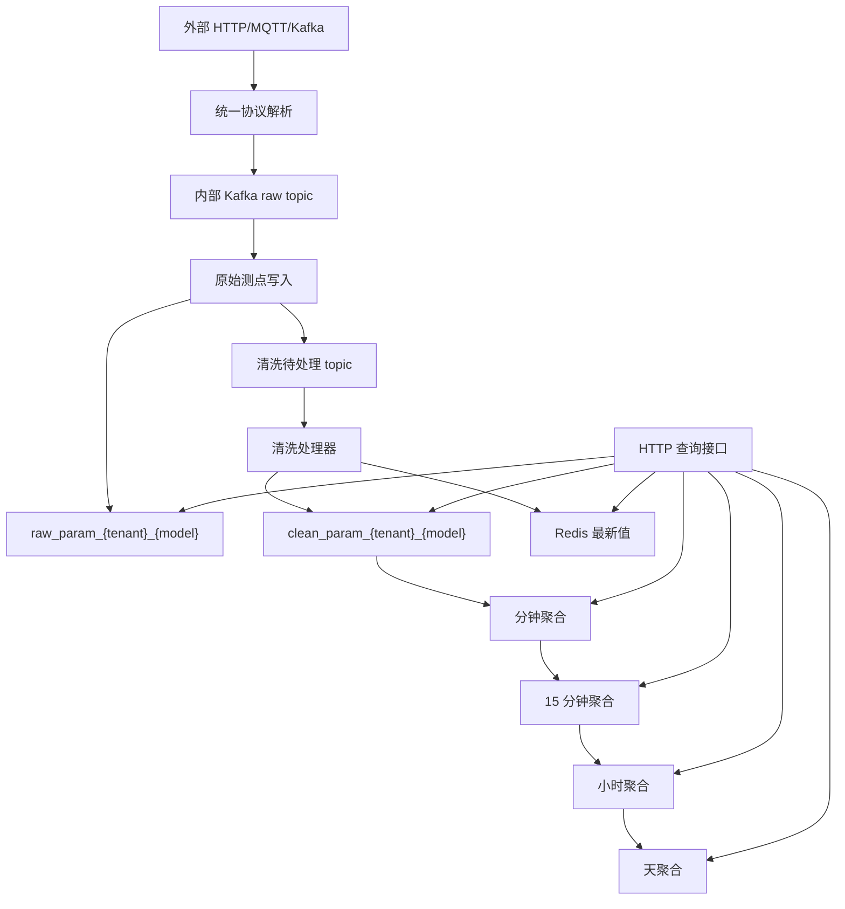

# 技术方案说明

## 1. 项目定位

Energy Data Access 是一个面向工业能源数据的接入、清洗、聚合服务。项目主要处理电、水、气、热等能源表计数据，目标是提供一个开源、可二次开发、容易本地部署的数采平台侧服务。

项目不直接做 Modbus 等现场总线采集，而是面向已有网关、边缘采集器、第三方系统或客户侧平台，统一接收它们上送的数据。

## 2. 典型场景

- 园区、工厂、楼宇的能源表计数据接入。
- 多租户 SaaS 或集团多工厂数据统一接入。
- 客户侧网关通过 MQTT、HTTP、Kafka 上送数据。
- 需要保留原始测点明细，用于审计、追溯和问题排查。
- 需要对表计数据做基础清洗和分粒度聚合。

## 3. 总体架构



## 4. 数据接入设计

### 4.1 外部接入方式

支持三种入口：

- HTTP：适合第三方系统直接调用。
- MQTT：适合网关、边缘设备、轻量数据上送。
- Kafka：适合客户侧已有 Kafka 或高吞吐平台转发。

三种入口均要求使用统一 JSON 协议，核心字段如下：

| 字段 | 作用 |
| --- | --- |
| `protocolVersion` | 协议版本，便于后续协议升级兼容 |
| `tenantMark` | 租户标识 |
| `modelMark` | 模型标识，例如电表、水表 |
| `deviceMark` | 设备标识 |
| `messageId` | 上送消息编号 |
| `timestamp` | 设备侧数据时间 |
| `data` | 测点键值集合 |

### 4.2 内部 Kafka 设计

外部入口统一转发到内部 Kafka topic：

- 原始接入 topic：`energy.raw.ingest`
- 清洗待处理 topic：`energy.clean.pending`
- 聚合事件 topic：`energy.aggregate.pending`

内部 raw topic 使用统一协议解码，不再针对不同外部来源设计多套解析逻辑。

Kafka key 使用：

```text
tenantMark|modelMark|deviceMark
```

这样可以让同一租户、同一模型、同一设备的数据尽量进入同一 partition，保持设备维度的消费顺序。

## 5. 存储设计

### 5.1 分表策略

原始、清洗、聚合数据都按租户和模型分表：

```text
raw_param_{tenant}_{model}
clean_param_{tenant}_{model}
agg_minute_{tenant}_{model}
agg_15min_{tenant}_{model}
agg_hour_{tenant}_{model}
agg_day_{tenant}_{model}
```

这样可以避免单租户所有设备都挤在一张大表，也避免“一个设备一张表”导致表数量过多。

### 5.2 原始测点

原始表保存的是“解码后的原始测点明细”，不是完整原始报文。原始测点不做去重，即使业务上重复上送，也完整保存，便于追溯真实上送行为。

### 5.3 清洗明细

清洗表保留每条清洗结果，包括质量码、是否有效、重复数据引用等。重复数据不删除，只标记为无效或重复，后续聚合只使用有效数据。

### 5.4 最新值

Redis 只用于保存清洗后的最新有效值，提高实时查询效率。Redis 不是事实数据源，清洗表仍然是可追溯依据。

Redis key：

```text
latest:{tenant}:{model}:{device}:{param}
```

## 6. 清洗设计

当前清洗覆盖常见 80% 场景：

- 格式异常：非数字、空值、无法转换。
- 公式转换：按配置公式将原始值转换成业务值。
- 量程校验：超过最小值或最大值标记异常。
- 瞬时量突变：超过最大变化阈值标记异常。
- 累计量倒退：累计量小于上一有效值时标记异常。
- 表计回卷：达到量程后从 0 附近重新累计时识别为回卷。
- 重复数据：同一设备、同一测点、同一时间只保留一条有效数据，其他记录标记为重复。

清洗配置按固定周期刷新，默认 4 分钟，也支持接口手动刷新。

## 7. 聚合设计

聚合粒度：

- 分钟
- 15 分钟
- 小时
- 天

计算策略：

- 分钟聚合从清洗明细计算。
- 15 分钟聚合从分钟聚合计算。
- 小时聚合从 15 分钟聚合计算。
- 天聚合从小时聚合计算。

历史数据默认不自动重算，提供手动重聚合接口，由人工指定租户、模型、设备、测点和时间范围。

累计量跨窗口计算时，会使用窗口前上一条有效值作为当前窗口起点，减少跨分钟、跨小时、跨天边界漏算。

## 8. 查询设计

查询接口包括：

- 原始测点查询。
- 清洗明细查询。
- 清洗最新值查询。
- 聚合数据查询。

聚合查询支持多模型，适合一个页面同时查询多个设备模型的数据。第一版多模型分页为按表查询后合并，后续可优化为游标分页或查询网关层全局排序。

## 9. 可靠性策略

- 原始落库成功后才发送清洗事件，保证清洗结果可以追溯。
- 清洗结果落库后更新 Redis，Redis 失败不阻断主链路。
- 原始测点不去重，保留真实上送记录。
- 清洗表保留异常、重复、无效数据，避免问题数据被静默丢弃。
- 支持手动重聚合，用于配置变化、历史修正或异常恢复。

## 10. 适配与扩展

推荐扩展方向：

- 补充认证鉴权和租户隔离。
- 增加 Prometheus 指标和链路监控。
- 增加管理端页面。
- 增强 TDengine 清洗和聚合表适配。
- 增加更完善的表达式函数和配置校验。
- 增加更多集成测试和压测脚本。

